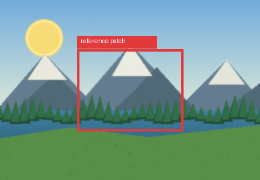
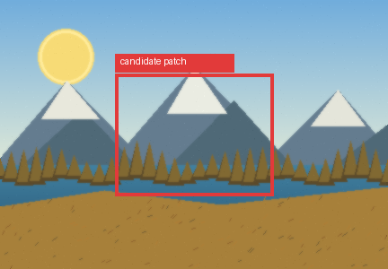

# visual-patch-audit

Compare and audit image patches for VLM and computer vision workflows.

[](https://pypi.org/project/visual-patch-audit/0.1.0/)


## Installation

```bash
pip install visual-patch-audit
```

For local development:

```bash
pip install -e ".[dev]"
```

## Usage

```python
from visual_patch_audit import compare_patches

report = compare_patches(
    reference_patches="reference_patches",
    candidate_patches="candidate_patches",
)

print(report)
```

## Visual example

This example compares a selected mountain/forest patch from one landscape image against a selected patch from another landscape image.

|  | Image | Patch |
| --- | --- | --- |
| **Reference** |  |  |
| **Image to compare** |  |  |

```python
from visual_patch_audit import compare_patch

result = compare_patch(
    "assets/readme/reference_patch.png",
    "assets/readme/candidate_patch.png",
)

print(result)
```

Actual result:

```python
{
    "similarity": {
        "histogram_similarity": 0.869569,
        "brightness_similarity": 0.988622,
        "contrast_similarity": 0.989545,
        "texture_similarity": 0.999121,
        "overall_similarity": 0.950974,
    },
    "issues": [],
}
```

The score is interpretable: the patches have similar brightness, contrast, texture, and color distribution.

Generate the README images and result again:

```bash
python examples/readme_visual_example.py
```

## Output

```python
{
    "reference_count": 20,
    "candidate_count": 5,
    "score": 82,
    "similarity": {
        "mean_histogram_similarity": 0.86,
        "mean_brightness_similarity": 0.91,
        "mean_contrast_similarity": 0.77,
        "mean_edge_density_similarity": 0.74,
        "mean_texture_similarity": 0.79,
    },
    "issues": [
        {
            "patch": "candidate_patches/patch_04.png",
            "type": "low_similarity",
            "severity": "medium",
            "message": "Patch is visually different from the reference set.",
        }
    ],
}
```

## Inspect one patch

```python
from visual_patch_audit import inspect_patch

features = inspect_patch("patch.png")
print(features)
```

## Compare two patches

```python
from visual_patch_audit import compare_patch

result = compare_patch("reference.png", "candidate.png")
print(result)
```

## Find outliers

```python
from visual_patch_audit import find_outlier_patches

outliers = find_outlier_patches("patches")
print(outliers)
```

## Overview

`visual-patch-audit` is a Python utility for comparing image patches using simple visual similarity metrics.

It is useful when building:

- VLM pipelines
- segmentation workflows
- object detection workflows
- visual dataset validation systems
- model output review tools
- image patch quality checks
- computer vision evaluation pipelines

## Features

- Compares one patch against another
- Compares candidate patches against reference patches
- Extracts interpretable patch features
- Detects visually unusual patches
- Reports similarity metrics and potential issues
- Supports JPEG, PNG, WEBP, TIFF, and BMP images
- Uses Pillow and numpy
- Simple API

## Limitations

`visual-patch-audit` uses deterministic visual similarity metrics. It does not determine semantic correctness, medical truth, diagnosis, object identity, or ground-truth validity. It does not replace expert review, model evaluation, annotation review, or safety-critical validation.

Use it as one inspection layer in a broader VLM or computer vision evaluation workflow. Outlier detection is intentionally simple and uses O(n^2) pairwise comparisons.

## Issues

Report issues at:
https://github.com/edujbarrios/visual-patch-audit

## Author

Eduardo J. Barrios  
edujbarrios@outlook.com

## License

Mozilla Public License 2.0
